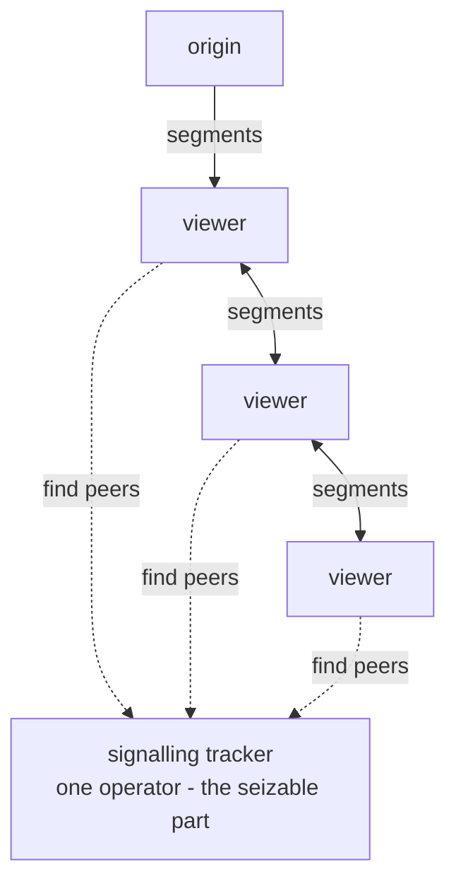
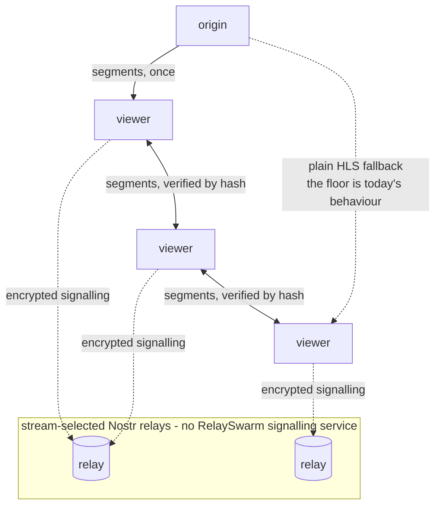
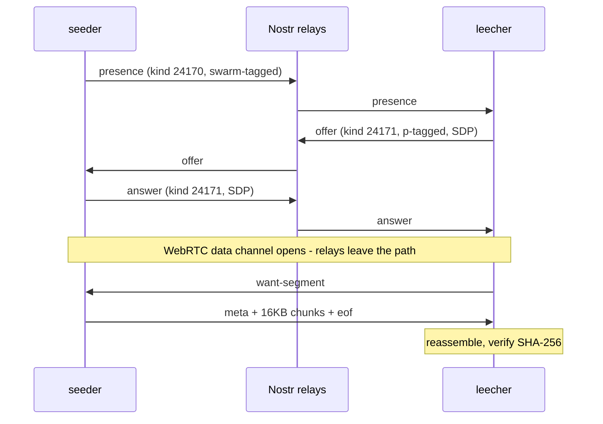

# RelaySwarm

Peer-assisted HLS live-stream distribution where WebRTC peer discovery and
signalling run over **Nostr relays** instead of a dedicated tracker.

Browser peer-assist needs rendezvous infrastructure; peers cannot find each
other from nothing. Widely deployed systems get it from WebTorrent-compatible
trackers - P2P Media Loader, the engine PeerTube embeds, gets its peer
introductions there
([its FAQ](https://github.com/Novage/p2p-media-loader/blob/main/FAQ.md#what-is-tracker)) -
a dedicated, application-specific service somebody operates:



A [NIP-53](https://github.com/nostr-protocol/nips/blob/master/53.md)
live-stream event can already carry a `relays` tag listing Nostr
relays. RelaySwarm's claim: **the stream can use that same general-purpose
relay layer for the swarm's signalling**, replacing the dedicated tracker
with redundant, stream-selected infrastructure:



## Status: proof of concept

`poc.mjs` proves the load-bearing claim end to end, with no browser and no
servers of its own:

1. Two peers (a **seeder** holding a media segment, a **leecher** wanting it)
   each connect to public Nostr relays.
2. The seeder announces presence as an ephemeral event (kind 24170, tagged
   with a swarm id); the leecher discovers it via its relay subscription.
3. SDP offer/answer are exchanged as ephemeral events (kind 24171, `p`-tagged
   to the counterparty) - the relays are the entire signalling path.
4. A WebRTC data channel opens ([werift](https://github.com/shinyoshiaki/werift-webrtc),
   pure-TypeScript WebRTC) and the segment moves peer-to-peer in 16KB chunks.
5. The leecher reassembles and verifies the segment by SHA-256.



Observed on public relays (relay.damus.io, nos.lol, relay.primal.net), Node
fan-out signalling averaged roughly 0.57 seconds. The recorded Chrome and
Safari flows transferred a verified 2MB end to end in 3.2 and 2.8 seconds
respectively, inside a common 4-second HLS segment. These measurements support
live feasibility; they do not claim that every peer joins inside a 2-second
segment. Short-segment and mobile tuning remain engine work.

<picture>
  <source media="(prefers-color-scheme: dark)" srcset="docs/chart-join-dark.svg">
  
</picture>

<picture>
  <source media="(prefers-color-scheme: dark)" srcset="docs/chart-throughput-dark.svg">
  
</picture>

```bash
npm install
npm test                   # end-to-end: PoC + 3-leecher fan-out, hash-verified against live relays
npm run poc                # just the two-peer PoC
node poc.mjs --relay wss://your.relay --size 1048576
```

`npm test` needs nothing but the repo, Node 22+ (for the global `WebSocket`;
tested on Node 24) and an internet connection - it proves the whole claim
against real relays and exits non-zero if any transfer fails verification.

The run prints a timing log and a JSON summary with the verified byte count,
per-phase timings and throughput. A real run, verbatim:

```json
{
  "ok": true,
  "swarmId": "poc-7c215d301a0c9d5a",
  "relays": ["wss://relay.damus.io", "wss://nos.lol", "wss://relay.primal.net"],
  "segmentBytes": 614400,
  "sha256Verified": true,
  "timingsMs": {
    "relaysConnected": 900,
    "seederDiscovered": 1092,
    "offerToAnswer": 114,
    "signallingTotal": 530,
    "transferMs": 51,
    "endToEnd": 1675
  },
  "throughputMBps": 11.49
}
```

### A second implementation

[RelaySwarmKit](https://github.com/forgesworn/relayswarm-kit) is a Swift
package implementing the same rendezvous - Nostr presence plus
NIP-44-encrypted SDP signalling (the PoC signs but does not encrypt) and a
data-channel transport - validated against published nostr-tools test
vectors. It exists so the protocol is specified by more than one codebase
from the start, which is exactly what the planned NIP draft needs.

## Beyond two peers: feasibility spikes

`spikes/` holds throwaway measurement code that pushes the same protocol
harder, with full results in [`spikes/RESULTS.md`](spikes/RESULTS.md):
one seeder serving 10 simultaneous leechers (23 signed events for the whole
swarm's signalling), a sustained 4Mbps live cadence with a 100% deadline hit rate over
five minutes, a leecher re-serving its verified segment to a third peer with
the origin silent (redistribution, not just fan-out), real Chrome and Safari peers, browser-to-browser transfer
with no server-side peer, cross-NAT with STUN alone (srflx/srflx), and the
two failure modes that shaped the design: symmetric NAT at VPN egresses
(hence a super-peer strategy rather than TURN) and background-tab timer
throttling (hence arriving peers announce, existing peers respond).

A browser peer completing a verified transfer (headless Chrome, captured
mid-run - `spikes/browser-peer.html`):


## Deliberately out of scope for the PoC

These are the project deliverables, not the PoC:

- **NIP-44 encryption** of signalling payloads (the PoC signs but does not
  encrypt; relays can read the SDP payload).
- **Authenticated segment digests.** The PoC verifies the transfer against a
  hash supplied by the sending peer - that detects corruption, not a
  malicious peer, since a bad seeder controls both bytes and hash. The
  production engine accepts a peer-delivered segment only against a digest
  signed by the streamer or fetched from the HTTPS origin.
- **Multi-peer swarm scheduling** - which peer serves which segment, origin
  fallback budgets, churn handling.
- **hls.js integration** - a loader plugin so any web player (zap.stream and
  other Nostr clients included) can join the swarm transparently, falling
  back to plain HLS when WebRTC is unavailable.
- **A NIP draft** specifying the presence/signal kinds and tags so
  independent implementations interoperate.
- NAT traversal hardening (the super-peer strategy for symmetric NATs,
  TURN only if wild data demands it) and mobile receive-path tuning.

## Privacy and decentralisation properties

Stated plainly, because the design only claims what it can prove:

- **No protocol-mandated central operator.** Signalling still needs
  rendezvous infrastructure - the point is that it is redundant,
  general-purpose and stream-selected rather than a dedicated tracker.
  Under the proposed protocol, relays and STUN servers are selected by the
  stream and carried in its signed NIP-53 event. The PoC defaults to Google's
  STUN service for demo reliability - pass `--stun`, or self-host coturn in one line.
  No dedicated tracker, no project-operated signalling service, no TURN by
  default.
- **Pseudonymous, not anonymous.** Swarm events carry no social npub and
  use independent per-session keys. Relays and network observers may still
  correlate swarm activity with a viewer's other Nostr use through shared
  connections, IP addresses and timing.
- **What relays see:** event kinds, tags, timing and connecting IPs.
  NIP-44 (a project deliverable, not yet in the PoC) hides the SDP body,
  not the fact that signalling is happening
  ([NIP-44 limitations](https://github.com/nostr-protocol/nips/blob/master/44.md#limitations)).
- **What peers see:** each other's network addresses - inherent to all
  P2P. The engine's answer is risk-tiered participation: an origin-only
  mode with no swarm subscription, no event publication and no
  RTCPeerConnection - such a viewer never appears in the swarm and exposes
  no address to peers, while the origin and website still see ordinary HLS
  requests, as they do today.
- **What the STUN operator sees:** an IP, a timestamp and the usual STUN
  protocol attributes. It receives no stream identifier and no media or
  signalling traffic; where super-peers are reachable, STUN is often
  unnecessary at all.
- **The floor is today's behaviour.** If WebRTC or every named relay is
  blocked, the player falls back to plain HLS from the origin.

Deeper material lives in `docs/`: a [landscape survey](docs/LANDSCAPE.md)
of neighbouring projects and the narrow novelty claim, a
[threat-model outline](docs/THREAT-MODEL.md) the deliverable engine will be
tested against, and an [FAQ](docs/FAQ.md) that answers the awkward
questions first.

## Why

Live video is the least sovereign layer of the otherwise decentralised Nostr
stack: the events, chat and payments are censorship-resistant, but the video
itself still flows from one HTTP origin that can be overwhelmed or cut. Peer
assistance inverts that - the bigger the audience, the more distribution
capacity the stream has, and the origin only feeds the swarm's edge.

MIT licensed.
