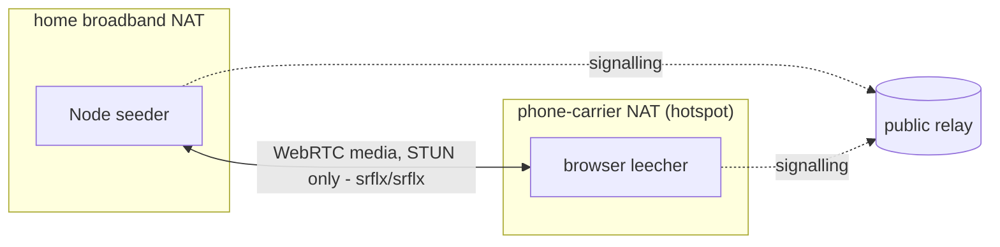

# Feasibility spike results

Measurements taken 10 August 2026 with the code in this directory. These
spikes are deliberately throwaway: push-to-all, no
scheduling, no hls.js. Star topology everywhere except the chain
redistribution run (`redistribute.mjs`). They exist to answer "will this actually work"
before the real engine is built, and each one either passed or taught a
design decision. All transfers are SHA-256 verified end to end - a
transport check against the hash the sending peer supplied, which catches
corruption but not a malicious seeder (who controls both bytes and hash);
origin-authenticated digests are engine work, stated in the README.

**Relay provenance.** The two-peer PoC measurements and the 10-leecher
fan-out receipt ran over public relays (relay.damus.io, nos.lol,
relay.primal.net). Unless a row says otherwise, the other spike runs
signalled over `wss://relay.trotters.cc`, an author-operated relay - the
pre-announcement policy kept the experimental swarm kinds off the major
public relays. Every spike reproduces against relays of your choosing with
`--relay`.

## Concurrency and cadence (Node peers, `fanout.mjs` / `cadence.mjs`)

| Run | Setup | Result |
|---|---|---|
| Fan-out, 5 leechers | 1 seeder, 2MB each, 400ms staggered arrivals, public relays | 5/5 verified, avg signalling 592ms, all end-to-end < 2s |
| Fan-out, 10 leechers | 1 seeder, 2MB each, 400ms stagger, public relays (receipt in `spikes/results/`) | 10/10 verified, avg signalling 571ms, wall 4.9s; the whole swarm's signalling bill was **23 unique signed events** (3 presence + 10 offers + 10 answers, 62 relay writes) to move 20MB |
| Fan-out via a single relay | Same test, one relay instead of three (self-hosted, author-operated) | 5/5 verified, avg signalling 956ms - a stream naming one swarm relay is viable |
| Sustained cadence | 2MB every 4s for 5 minutes to 3 leechers (a simulated 4Mbps live stream) | 225/225 segments verified, **100% deadline hit rate**, transfer p50 570ms / p95 917ms / max 1.9s |
| Leecher-becomes-seeder (`redistribute.mjs`, 11 Aug) | Chain origin -> A -> B; the origin announces only until A is served and then falls silent, so B's copy provably cannot come from it (receipt in `spikes/results/`) | Two runs, both pass: A's copy verified from the origin, **B's copy verified from A**, 8 signed events for the whole two-hop chain, hop signalling 290-422ms. Redistribution - the "viewers are the CDN" claim - is demonstrated, not just designed |

## Real browsers (`browser-peer.html` + `seeder.mjs`)

| Run | Setup | Result |
|---|---|---|
| Chrome 151 leecher | Native WebRTC, in-page nostr-tools signalling, vs the Node seeder | 2MB verified, 13.5MB/s, end-to-end 3.2s |
| Safari 17.6 leecher | Same | 2MB verified, 12.7MB/s, end-to-end 2.8s |
| Two machines over wifi | Second laptop's Safari vs the Node seeder, same LAN | 2MB verified, 9.4MB/s over the radio, signalling 829ms |
| Browser-to-browser | Remote browser as seeder, local Chrome as leecher, no Node peer at all | 2MB verified, 4.0MB/s, ICE pair host/prflx |
| Handheld leecher | Phone-class handheld over LAN wifi (mobile-Safari-class browser; the device reported a desktop-class UA, so exact model is unconfirmed - one untuned sample) | 2MB verified; 0.4MB/s on this device - fine for 6s segments, marginal for 4s, and untuned (receive-path tuning is engine work) |

Playback engines confirmed separately via the public hls.js demo: iPhone
(iOS 26, ManagedMediaSource) and GrapheneOS Vanadium (MSE) both play.

## NAT reality (`crossnat` runs of `browser-peer.html`)



| Run | Setup | Result |
|---|---|---|
| Cross-NAT, STUN only | Laptop tethered to a phone hotspot (no LAN path) vs seeder on home broadband, signalling via relay | Connected and verified; repeat run's ICE pair **srflx/srflx** - pure STUN traversal both sides. Segment fully dispatched 1.1s after the offer |
| Behind a commercial VPN, on LAN | VPN active, both machines on one LAN | Verified, but ICE used the LAN path (remote candidate `host`) - VPNs that allow local networks get bypassed by ICE, so this run says nothing about VPN traversal |
| Behind a commercial VPN, on hotspot | No LAN path, VPN egress only | Signalling worked through the tunnel; **STUN-only ICE failed, reproduced twice** (60s timeout). Symmetric NAT at the VPN egress |
| Background tab | Chrome seeder tab backgrounded 75s before the leecher arrived | Transfer unimpaired once connected (643ms, 3.1MB/s); discovery slowed to 16s because timer-driven announces get throttled |

## What the failures decided

- **Hard NATs get topology, not TURN.** A TURN server relays every media
  byte at the same cost as the origin serving directly, and the origin is
  already the fallback. Symmetric-NAT clients (VPN egress, CGNAT) can
  often dial out to a publicly reachable peer, so super-peers absorb much
  of the hard-NAT population with plain WebRTC - not where UDP or WebRTC
  itself is blocked, where plain HLS from the origin remains the universal
  fallback. TURN only if wild data demands it.
- **Announce direction matters.** Background tabs answer WebSocket
  messages instantly but run timers slowly, so the protocol should have
  arriving peers announce and existing peers respond, not seeders beacon
  on an interval.

## Caveats, stated honestly

- Cross-NAT is one real NAT pair (home broadband vs one mobile carrier)
  and the VPN rows are one provider. Wide sampling across carriers, CGNAT
  variants and VPNs is engine-phase work.
- Firefox is untested (not installed on the measurement machines). iOS
  Safari is confirmed for hls.js playback (ManagedMediaSource) but has not
  yet run the swarm leecher flow itself.
- Browser signalling includes a non-trickle ICE gathering wait (capped
  1.2s); trickle ICE is a deliverable-era optimisation that removes it.

Reproduce any of it: `node spikes/fanout.mjs`, `node spikes/cadence.mjs`,
`node spikes/redistribute.mjs`, or `node spikes/run-browser-test.mjs`
(macOS) against relays of your choosing with `--relay`.

## Local live emulation (`emulate-live.mjs`)

One origin "hosts" a stream (512KB segment every 4s, 60s, 15 segments) and
5 viewers join on a 2.5s stagger, all on one machine via relay.trotters.cc.
Each viewer tries a peer holder first (verify-then-reseed ordering, jittered
fallback window) and the origin otherwise. The receipt
(`spikes/results/emulate-live-20260824T103614Z.json`):

| Metric | Value |
|---|---|
| Fetches, all SHA-256 verified | 75/75 |
| Deadline hit rate (4s per segment) | 100% |
| **Origin serves per segment** | **1.0** (15 serves, 7.5MB egress) |
| Peer-to-peer serves | 60/75 (80%) |
| Misses / fallbacks / hash failures | 0 / 0 / 0 |

That is the thesis in one command: the origin fed only the swarm's edge
(viewer-0, which re-served 60 times), and the crowd carried the rest.
Honest caveats: loopback transfers, so this proves the shape, not uplink
capacity (that is `uplink-fanout.mjs`'s pending measurement); the first
tier is deterministic here (viewer-0 always becomes the holder - spreading
that load is scheduling, M2); and the hash authority is the origin's
announce, which proves transport, not provenance, as documented for the
PoC. Reproduce: `node spikes/emulate-live.mjs --viewers 5 --duration 60`.

## Shadow mode in real Chrome (`test/hls-swarm-browser.mjs`)

`src/browser/hls-swarm.mjs` attached to hls.js in headless Google Chrome,
playing a live HLS stream: ffmpeg `testsrc2` at 640x360, 1.5 Mbps H.264 plus
AAC, 2-second MPEG-TS segments, served over local HTTP. Signalling ran through
a local relay (`test/support/local-relay.mjs`). The viewers were eight honest
swarm viewers joining 3 s apart, one viewer serving deliberately corrupted
bytes, and one baseline viewer with no swarm. The run lasted 90 s after the
last join, with `originFallbackMs` at 1500. Receipt:
`results/hls-swarm-shadow-20260917T170248Z.json`.

| Measure (honest viewers) | Result |
|---|---|
| Fragments the player loaded from the origin | 505 |
| Races resolved (at least one peer connected) | 453 |
| Peer delivered, verified against the origin bytes, within 1.5 s | 441 (97.4%) |
| Late (within 6 s) / missed / corrupt | 6 / 5 / 1 |
| Per-viewer median peer latency from fragment load start | 41-269 ms (median of medians 58 ms) |
| Offer-to-open signalling, per-viewer median | 46-99 ms (one viewer 737 ms) |
| Bytes verified from peers / uploaded | 187.0 MB / 187.8 MB |
| Player stalls / fatal errors, swarm viewers | 0 / 0 (baseline also 0 / 0) |
| Swarm errors, uncaught page errors | 0, 0 |
| `stop()` restored the fragment loader | 9 of 9 |
| Relay events published, whole run, all viewers | 188 |

The corrupted delivery was caught by hash against the origin bytes. That
viewer banned the sender and closed the link, and the corrupt bytes were
never counted as delivered. A four-viewer trial the same afternoon: 91.3% in
time, 3 corrupt deliveries caught by 3 viewers.

What this proves:

- The hls.js integration works in a real browser without disturbing
  playback. Bytes reach hls.js before any swarm work, including when
  hls.js transfers the buffer to its transmux worker.
- Peers find each other over a relay, open data channels, advertise held
  segments on the channel and serve them under backpressure.
- A tampered peer is detected and dropped.
- `stop()` fully detaches.

What it does not prove:

- **Networks.** Every viewer shared one machine and every connection was
  `host/host`. Latencies reflect loopback, not the internet. NAT traversal,
  carrier and venue networks, and real uplink limits are untested by this run.
- **Scale.** Eight viewers, not hundreds.
- **Timing under load.** The machine was heavily loaded by unrelated work
  (load average above 100 during the run). Timings are indicative only.
- **Late joiners found every peer full.** The last honest viewer and the
  corrupt viewer joined after the others had reached `maxPeers` (6): 42 offers
  were refused and those two viewers raced with no peers (`noPeers` 48 and 45).
  They played normally from the origin, as designed. There is no peer
  rotation, so in a large audience newcomers depend on churn or spare
  capacity. That is the next engine problem, and the metrics expose it
  (`offersRefused`, `noPeers`).
- **Test-only interface unlock.** Chrome only offers host candidates on the
  default-route interface until a page holds a media permission. On the test
  machine that interface was a VPN, so same-machine viewers could not reach
  each other. The harness grants a fake microphone to unlock all interfaces.
  Real viewers rely on STUN server-reflexive candidates instead, as the
  cross-NAT rows above do.

Run: `npm run test:browser -- --viewers 8 --duration 90` (needs ffmpeg with
libx264 and Google Chrome; Chromium without proprietary codecs cannot play
H.264). The guarantees a host page relies on are also unit-tested without a
browser: `npm run test:swarm`.

## Pending: real-uplink fan-out (`uplink-fanout.mjs`)

The "2-4 served peers per home connection" figure elsewhere in these docs
is an estimate from typical upload asymmetry, not a measurement - this
spike is the harness that replaces it with a receipt. One seeder on a real
home connection, N leechers on other networks, each leecher reporting its
own transfer time against the 4s and 6s segment deadlines. Loopback smoke
passed 2026-08-24 (1 seeder + 2 leechers, both SHA-256 verified,
10-11MB/s over relay.trotters.cc); the cross-machine runs are pending.

How to run it:

```bash
# Machine A (home connection) - start the seeder first, keep it running:
node spikes/uplink-fanout.mjs --mode seeder --swarm uplink-1

# Machine B (another network, e.g. tethered to a phone hotspot) - one
# process per leecher; this is N=4, add or remove to taste:
for i in 1 2 3 4; do
  node spikes/uplink-fanout.mjs --mode leecher --swarm uplink-1 --label "b-$i" \
    > "leecher-b-$i.json" 2>/dev/null &
done; wait
```

- Each leecher writes one JSON receipt: `transferMs` (want-segment to
  eof), `throughputMBps`, `deadlineHit` (4s) and `deadlineHit6s`, plus
  `sha256Verified` (a pass without verification is a fail) and `pair` -
  candidate TYPES only (e.g. `srflx/srflx`), proving the run crossed the
  uplink rather than a LAN path without recording any address. Expect
  `host/host` only on loopback; a real run showing `host` means the
  leecher found a local path and the run says nothing about the uplink.
- The seeder prints a JSON summary (peers connected, per-leecher serve
  times) on Ctrl-C or `--duration <s>`.
- Raise N across runs until `deadlineHit` starts going false; the last
  all-true N is the per-connection serve count this estimate needs.
- Defaults: 2MB segment, relay `wss://relay.trotters.cc` (spike policy;
  `--relay` to change), 120s leecher timeout. `--deadline 6000` to test
  the 6s budget as primary.
- Honest caveat: N processes on one leecher machine share that machine's
  own downlink, so runs where the leecher side is the bottleneck say so
  (throughput collapses symmetrically); real audience diversity wants one
  leecher per machine where possible.

## Joining late, with and without rotation (`test/hls-swarm-browser.mjs --waves`)

An audience arrives over an hour, so the harness now joins viewers in waves:
twelve honest viewers in three waves of four, 30 s between waves, 3 s apart
within one, then 60 s of measurement. Same stream and relay as the shadow run
above. `RELAYSWARM_NO_ROTATION=1` turns rotation, retries and referrals off, so
before and after differ by the policy alone. Three runs each.

The peer limit is the whole experiment. At the default six, twelve viewers
never saturate each other and late joiners are served within seconds either
way (`...rotation-off-20260917T203212Z.json`,
`...rotation-on-20260917T203613Z.json`). At two, the swarm is genuinely full
and the question has teeth. The corrupt peer is off in these runs: its ban
frees slots, which hides the starvation being measured.

| Tight shape, `--maxPeers 2 --corruptPeer 0` | Rotation off | Rotation on |
|---|---|---|
| Worst wait for a first peer-served segment | 37.6 / 37.7 / 38.0 s | **16.4 / 18.7 / 18.5 s** |
| Median wait across all viewers | 1.1 / 1.2 / 1.4 s | 1.5 / 2.0 / 4.4 s |
| In-time share | 0.969 / 0.968 / 0.964 | 0.954 / 0.962 / 0.962 |
| Viewers never served by a peer | 0 | 0 |
| Links rotated out | 0 | 4 / 4 / 3 |
| Swarm errors, corrupt bytes accepted | 0 | 0 |

Receipts: `...rotation-off-{203943,205652,210238}Z.json` and
`...rotation-on-{205334,205944,210536}Z.json`.

What it says: the shut-out viewer is the fourth of the first wave, once the
first three have filled each other. Without rotation it waits about 38 s -
until the next wave arrives and shakes the topology - and that figure repeats
to within half a second across three runs. With rotation it waits about 18 s.
The cost is a slightly slower median and about one point of in-time share,
from the extra dialling that retries and referrals generate.

What it does not say: the later waves were never starved in either mode, so
the failure this was built for - a late joiner meeting nothing but full peers
and playing from the origin for ever - did not reproduce in this shape. Natural
churn frees slots faster than rotation does. The 42 refusals in the earlier
8-viewer run came from a different shape: every viewer joining inside 30 s and
dialling every other, where refusals stack up cooldowns.

Two policies were measured and rejected on the way, and their receipts are
kept:

- **Rotate for any caller** (`...rotation-on-20260917T204343Z.json`): worst
  wait 31.5 s. An evicted peer re-dials immediately and displaces a third, so
  the swarm spends its time re-connecting.
- **Treat the `open` presence hint as a gate** (`...204917Z.json`): worst wait
  35.4 s. In a swarm where nearly every peer is full, a viewer holding one link
  stops dialling and stays on one link. The hint now only chooses referrals.

Honest caveats: one machine, so every candidate pair is `host/host` and the
latencies are loopback; load average was 14-25 throughout, and one rotation-on
run recorded 4 player stalls on every viewer **including the no-swarm
baseline**, which is the machine, not the swarm. Three runs per mode is enough
for the worst-case figure, which is stable to within half a second, and not
enough to separate a one-point difference in in-time share from noise.
Reproduce with
`node test/hls-swarm-browser.mjs --viewers 12 --waves 3 --duration 60 --maxPeers 2 --corruptPeer 0`.

